# vue性能优化及原理

## 参考
本文根据黄轶的老师文章 [揭秘 Vue.js 九个性能优化技巧](https://juejin.cn/post/6922641008106668045) 启发整理而成，本文会根据自己的实践并且分析优化的原理。

* [揭秘 Vue.js 九个性能优化技巧](https://juejin.cn/post/6922641008106668045)

## 前期准备
该项目由 Vue.js 核心成员 [Guillaume Chau](https://github.com/Akryum) 分享的[PPT](https://slides.com/akryum/vueconfus-2019)。该项目是一个 Vue.js 性能优化的示例项目，包含了 9 个性能优化技巧。

关于 performance 工具的使用，可以用我总结的 [Performance 工具篇](../../devTools/performance/README.md) 这篇文章作为参考。

### 安装依赖
```bash
git clone https://github.com/Akryum/vue-9-perf-secrets.git
```

我这边安装过程并不顺利，遇到各种报错，挂载了代理，但是都没有用。但是非常确定是网络引起问题，切换源和全局代理各种鼓捣总算好了。

```shell
# 运行一下
yarn run serve
```

## Functional components（函数式组件）
先尝试录制一下，看看效果

优化前：
```html
<template>
  <div class="cell">
    <div v-if="value" class="on"></div>
    <section v-else class="off"></section>
  </div>
</template>

<script>
export default {
  props: ['value'],
}
</script>
```
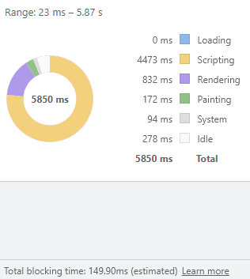

优化后：
```html
<template functional>
  <div class="cell">
    <div v-if="props.value" class="on"></div>
    <section v-else class="off"></section>
  </div>
</template>
```
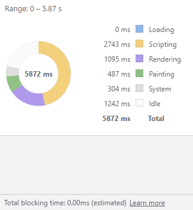

看 scripting 占用的时间，清晰的看到了优化的效果。

JS 引擎是单线程的运行机制，JS 线程会阻塞 UI 线程，所以当脚本执行时间过长，就会阻塞渲染，导致页面卡顿。

有状态组件 在实例化的过程中会初始化一系列，诸如 data(或state)、computed、watch、生命周期等等。而函数式组件是没有这些东西的，所以在渲染的时候，会比有状态组件快很多。

再深入来说，函数式组件在渲染时不会创建实例，而是通过调用工厂函数（h函数）来生成VNode，参考：[函数式组件的挂载和原理](https://hcysunyang.github.io/vue-design/zh/renderer.html#%E5%87%BD%E6%95%B0%E5%BC%8F%E7%BB%84%E4%BB%B6%E7%9A%84%E6%8C%82%E8%BD%BD%E5%92%8C%E5%8E%9F%E7%90%86)

举个例子，挂载一个有状态组件：

```js
function mountStatefulComponent(vnode, container, isSVG) {
  // 创建组件实例
  const instance = new vnode.tag()
  // 渲染VNode，如果有子组件，会递归地渲染子组件
  instance.$vnode = instance.render()
  // 挂载
  mount(instance.$vnode, container, isSVG)
  // el 属性值 和 组件实例的 $el 属性都引用组件的根DOM元素
  instance.$el = vnode.el = instance.$vnode.el
}
```

如果使用函数式组件：

```js
function mountFunctionalComponent(vnode, container, isSVG) {
  // 获取 VNode
  const $vnode = vnode.tag()
  // 挂载，这里一次性生成了vnode，不会递归地渲染子组件
  mount($vnode, container, isSVG)
  // el 元素引用该组件的根元素
  vnode.el = $vnode.el
}
```

在上面的例子中，函数式组件不会递归地渲染子组件。这是因为函数式组件的渲染函数是没有实例的，所以也就没有子组件的实例。所以，函数式组件的渲染函数只能返回一个 VNode，而不能返回一个数组。

## Child component splitting（子组件拆分）

优化前的组件代码如下：

```html
<template>
  <div :style="{ opacity: number / 300 }">
    <div>{{ heavy() }}</div>
  </div>
</template>

<script>
export default {
  props: ['number'],
  methods: {
    heavy () {
      const n = 100000
      let result = 0
      for (let i = 0; i < n; i++) {
        result += Math.sqrt(Math.cos(Math.sin(42)))
      }
      return result
    }
  }
}
</script>
```
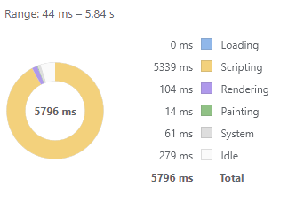

优化后的组件代码如下：

```html
<template>
  <div :style="{ opacity: number / 300 }">
    <ChildComp/>
  </div>
</template>

<script>
export default {
  components: {
    ChildComp: {
      methods: {
        heavy () {
          const n = 100000
          let result = 0
          for (let i = 0; i < n; i++) {
            result += Math.sqrt(Math.cos(Math.sin(42)))
          }
          return result
        },
      },
      render (h) {
        return h('div', this.heavy())
      }
    }
  },
  props: ['number']
}
</script>
```
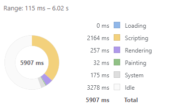

最外层父组件会渲染 300 个子组件，将 heavy 方法提取到了子组件中，这样就不会在父组件中重复执行了。

那么为什么提取到子组件就不重复执行了呢？

> 作者回答：*Vue is smart enough to not rerender children components if it doesn't need to.*

这是因为组件的渲染是基于组件的状态和属性的，只有当组件的状态或属性发生变化时，组件才会重新渲染。

我新建了个 *ChildComputed* 页面，尝试了下计算属性，性能也是同上差不多的。利用了computed的缓存，只有当依赖的数据发生变化时，才会重新计算。

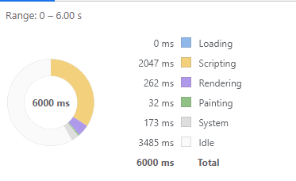

## Local variables（局部变量）
优化前的组件代码如下：

```html
<template>
  <div :style="{ opacity: start / 300 }">{{ result }}</div>
</template>

<script>
export default {
  props: ['start'],
  computed: {
    base () {
      return 42
    },
    result () {
      let result = this.start
      for (let i = 0; i < 1000; i++) {
        result += Math.sqrt(Math.cos(Math.sin(this.base))) + this.base * this.base + this.base + this.base * 2 + this.base * 3
      }
      return result
    },
  },
}
</script>
```


优化后的组件代码如下：

```html
<template>
  <div :style="{ opacity: start / 300 }">{{ result }}</div>
</template>

<script>
export default {
  props: ['start'],
  computed: {
    base () {
      return 42
    },
    result ({ base, start }) {
      let result = start
      for (let i = 0; i < 1000; i++) {
        result += Math.sqrt(Math.cos(Math.sin(base))) + base * base + base + base * 2 + base * 3
      }
      return result
    },
  },
}
</script>
```
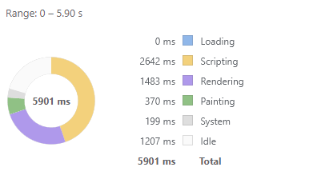

那么为啥这个差异会造成性能上的差异呢，原因是你每次访问 this.base 的时候，由于 this.base 是一个响应式对象，所以会触发它的 getter，进而会执行依赖收集相关逻辑代码。

虽然computed有缓存依赖，但是在计算result属性的过程中，它依赖于this.start和this.base两个属性。而在父组件更新start属性时，会触发当前组件的重新渲染，从而导致computed属性重新计算。由于result的计算过程相对较耗时（循环1000次），所以每次重新计算都会造成一定的性能损耗。

此外，即使computed依赖的属性没有变化，也有可能会触发computed属性的重新计算。例如，在Vue 2.x中，当依赖属性的引用发生变化时，也会触发computed属性的重新计算。因此，在处理大量计算密集型的computed属性时，需要特别小心，避免造成性能问题。

### 其它方式：将计算的逻辑移到父组件中
将计算result的逻辑移到父组件中，通过props将结果传递给子组件。这样可以减少子组件的计算量。在测试结果上还更快一些，可以根据实际业务场景来调整。

LocalVar.vue
```html
<template>
  <Benchmark title="Local variables">
    <template #toolbar>
      <PlayToggle v-model="play"/>
    </template>

    <template #on>
      <div class="grid">
        <LocalVarOn
          v-for="(n, index) of list"
          :key="index"
          :start="n"
          :result="result(base,n)"
          class="cell"
        />
      </div>
    </template>

    <template #off>
      <div class="grid">
        <LocalVarOff
          v-for="(n, index) of list"
          :key="index"
          :start="n"
          class="cell"
        />
      </div>
    </template>
  </Benchmark>
</template>

<script>
import LocalVarOn from './LocalVarOn.vue'
import LocalVarOff from './LocalVarOff.vue'

export default {
  components: {
    LocalVarOn,
    LocalVarOff,
  },

  data () {
    return {
      play: false,
      list: [],
    }
  },

  watch: {
    play (value) {
      if (value) this.generate()
    },
  },

  created () {
    this.count = 300
    this.generate()
  },
  computed: {
    base () {
      return 42
    }
  },
  methods: {
    generate () {
      const data = []
      for (let i = 0; i < this.count; i++) {
        data.push(Math.random() * 300)
      }
      this.list = data
      this.play && requestAnimationFrame(this.generate)
    },
    result ({ base, start }) {
      let result = start
      for (let i = 0; i < 1000; i++) {
        result += Math.sqrt(Math.cos(Math.sin(base))) + base * base + base + base * 2 + base * 3
      }
      return result
    },
  },
}
</script>

<style lang="stylus" scoped>
.grid
  margin 24px auto
  max-width (20 * 36px)

.cell
  float left
  width 32px
  height @width
  margin 2px
  color transparent
  background #42b983
  border-radius 50%
</style>

```

LocalVarOn.vue
```html
<template>
  <div :style="{ opacity: start / 300 }">{{ result }}</div>
</template>

<script>
export default {
  props: ['start', 'result']
}
</script>
```

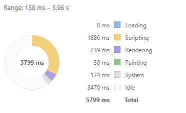

## Reuse DOM with v-show（v-show 复用 DOM）
优化前的组件代码如下：

```html
<template functional>
  <div class="cell">
    <div v-if="props.value" class="on">
      <Heavy :n="10000"/>
    </div>
    <section v-else class="off">
      <Heavy :n="10000"/>
    </section>
  </div>
</template>
```
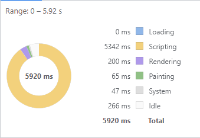

优化后的组件代码如下：
```html
<template functional>
  <div class="cell">
    <div v-show="props.value" class="on">
      <Heavy :n="10000"/>
    </div>
    <section v-show="!props.value" class="off">
      <Heavy :n="10000"/>
    </section>
  </div>
</template>
```
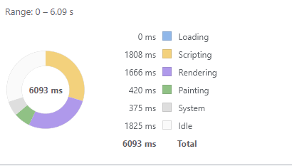

v-if 指令在编译阶段就会编译成一个三元运算符，条件渲染，比如优化前的组件模板经过编译后生成如下渲染函数：
```js
function render() {
  with(this) {
    return _c('div', {
      staticClass: "cell"
    }, [(props.value) ? _c('div', {
      staticClass: "on"
    }, [_c('Heavy', {
      attrs: {
        "n": 10000
      }
    })], 1) : _c('section', {
      staticClass: "off"
    }, [_c('Heavy', {
      attrs: {
        "n": 10000
      }
    })], 1)])
  }
}
```

当条件 props.value 的值变化的时候，会触发对应的组件更新，对于 v-if 渲染的节点，由于新旧节点 vnode 不一致，在核心 diff 算法比对过程中，会移除旧的 vnode 节点，创建新的 vnode 节点，那么就会创建新的 Heavy 组件，又会经历 Heavy 组件自身初始化、渲染 vnode、patch 等过程。
因此使用 v-if 每次更新组件都会创建新的 Heavy 子组件，当更新的组件多了，自然就会造成性能压力。

而当我们使用 v-show 指令，优化后的组件模板经过编译后生成如下渲染函数：

```js
function render() {
  with(this) {
    return _c('div', {
      staticClass: "cell"
    }, [_c('div', {
      directives: [{
        name: "show",
        rawName: "v-show",
        value: (props.value),
        expression: "props.value"
      }],
      staticClass: "on"
    }, [_c('Heavy', {
      attrs: {
        "n": 10000
      }
    })], 1), _c('section', {
      directives: [{
        name: "show",
        rawName: "v-show",
        value: (!props.value),
        expression: "!props.value"
      }],
      staticClass: "off"
    }, [_c('Heavy', {
      attrs: {
        "n": 10000
      }
    })], 1)])
  }
}
```

`v-if`是一种条件渲染指令。每次条件的值发生改变时，`v-if`会重新渲染DOM元素，因为它是在每次渲染时动态插入和移除元素的。

`v-show`也是一种条件渲染指令，在CSS中控制元素的显示或隐藏，隐藏元素的`display`属性设置为`none`，而显示则是去掉该属性。

**注意：** 在使用 `v-show` 的时候，无论隐藏或是显示所有子组件都会渲染，对应的生命周期钩子函数都会执行，而使用 `v-if` 的时候，没有命中的子组件是不会渲染的，对应的生命周期钩子函数都不会执行。

`v-if`和`v-show`都可能引起DOM的回流（reflow），但只有`v-if`会引起DOM的重绘（repaint）。需要注意的是，虽然`v-show`不会引起重绘，但是如果频繁地改变元素的`display`属性，也会导致性能下降，因为浏览器需要不断地重新计算元素的布局信息。

**总结：** 如果需要频繁切换，则使用 `v-show` 较好；如果在运行时绑定条件很少改变，则 `v-if` 会更合适。

> 同时使用 v-if 和 v-for 是不推荐的，因为这样二者的优先级不明显。

### KeepAlive（缓存组件）
使用 KeepAlive 组件缓存 DOM，我们点击按钮在 Simple page 和 Heavy Page 之间切换，会渲染不同的视图，其中 Heavy Page 的渲染非常耗时。

优化前的组件代码如下：

```html
<template>
  <div id="app">
    <router-view/>
  </div>
</template>
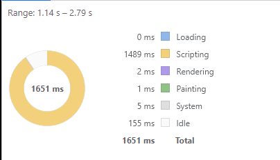

优化后的组件代码如下：

```html
<template>
  <div id="app">
    <keep-alive>
      <router-view/>
    </keep-alive>
  </div>
</template>
```
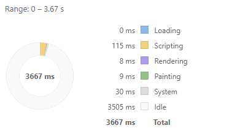

切换路由视图，都会重新渲染一次组件，渲染组件就会经过组件初始化，render、patch 等过程，如果组件比较复杂，或者嵌套较深，那么整个渲染耗时就会很长。

我们可以使用 KeepAlive 组件缓存 Heavy Page 的 DOM，当我们切换到 Heavy Page 的时候，不会重新渲染 Heavy Page，而是直接复用缓存的 DOM。

但是使用 KeepAlive 组件并非没有成本，因为它会占用更多的内存去做缓存，这是一种典型的空间换时间优化思想的应用。

## Deferred features（延时功能）
使用 `Deferred` 组件延时分批渲染组件

优化前的组件代码如下：
```html
<template>
  <div class="deferred-off">
    <VueIcon icon="fitness_center" class="gigantic"/>

    <h2>I'm an heavy page</h2>

    <Heavy v-for="n in 8" :key="n"/>

    <Heavy class="super-heavy" :n="9999999"/>
  </div>
</template>
```

优化后的组件代码如下：
```html
<template>
  <div class="deferred-on">
    <VueIcon icon="fitness_center" class="gigantic"/>

    <h2>I'm an heavy page</h2>

    <template v-if="defer(2)">
      <Heavy v-for="n in 8" :key="n"/>
    </template>

    <Heavy v-if="defer(3)" class="super-heavy" :n="9999999"/>
  </div>
</template>

<script>
import Defer from '@/mixins/Defer'

export default {
  mixins: [
    Defer(),
  ],
}
</script>
```

我们点击按钮在 Simple page 和 Heavy Page 之间切换，会渲染不同的视图，其中 Heavy Page 的渲染非常耗时。我们开启 Chrome 的 Performance 面板记录它们的性能，然后分别在优化前后执行如上的操作，会得到如下结果。
